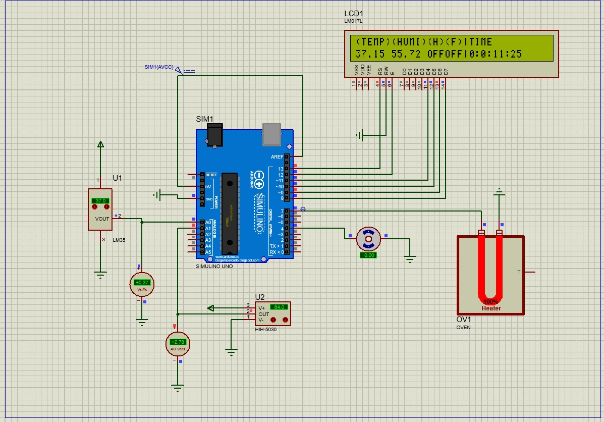

# Temp Humi Controller
Simple Arduino project that read temperature and humidity from sensors then display it on LCD screen
and control of heater and fan to keep temperature and humidity in chosen degrees.

## Project tasks details
- keep the temprature 37.5 (+/- 0.5)
- keep the humidty between (55-65)
- you use the oven to heat
- use the fan to cool
- Duration is about 18 Day
- Display the elapsed time DD:HH:MM:SS

---

## Project components
-  Arduino UNO
-  LCD 32x2 (LM017L)
-  Temperature sensor (LM35)
-  Humidity sensor (HIH-5030)
-  Heater (OVEN)
-  Fan (Motor)

## Project schematic

---

### Contributing
Feel free to fork this repository and submit pull requests.

### Contact
If you have any questions or issues, please open an issue on this repository or contact

mail: ahmedhosam.dev@gmail.com
